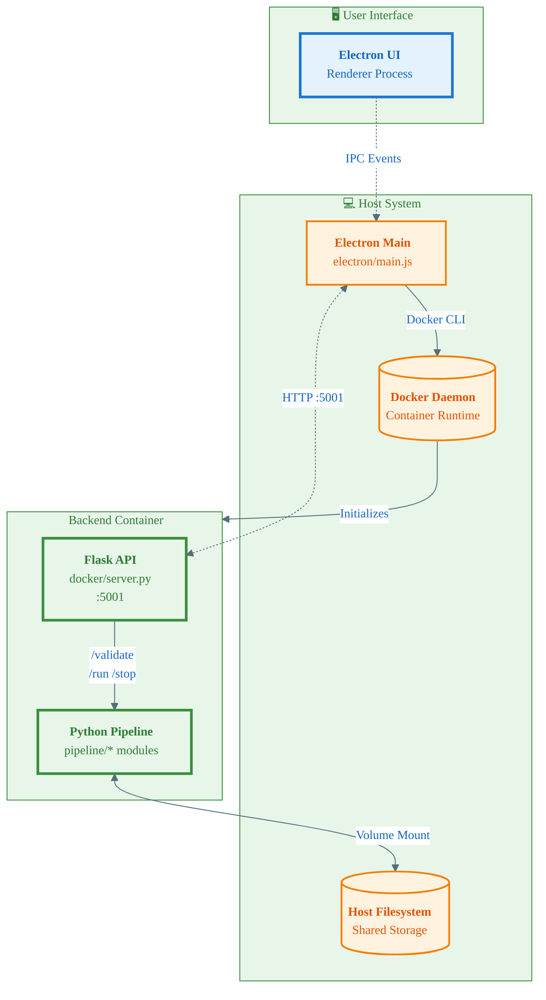

<div align="center">

# MDPI — Plankton Imaging Pipeline Desktop App


</div>

### Description

This multi-stage plankton imaging pipeline was created to process the Leibniz IGB's MDPI camera data, and so inspired this repository's name. The pipeline will work with any image data, but the processing assumes the context that the image data represents a descending water column profile, captured at a stable framerate. The UI is built with Electron and orchestrates a Dockerized Python/Flask backend that validates inputs and executes the processing steps end‑to‑end: depth profiling, flatfielding, object detection, object classification, and concentration plotting. For more information on the processing steps, navigate to the README file in the `/pipeline` folder.

The app automatically provisions the backend container, streams live logs and progress, and allows starting/stopping the pipeline across one or more input directories from a friendly GUI.

---

### Table of Contents

- [Description](#description)
- [Technologies Used](#technologies-used)
- [Architecture](#architecture)
  - [Responsibilities](#responsibilities)
- [Installation](#installation)
  - [Clone this Repository](#clone-this-repository)
  - [Option 1: Set up the Electron UI](#option-1-set-up-the-electron-ui)
  - [Option 2: Prepare a Conda Environment for Direct Python Calls](#option-2-prepare-a-conda-environment-for-direct-python-calls)
- [Launching the Electron UI](#launching-the-electron-ui)
  - [Troubleshooting (Linux sandbox error)](#troubleshooting-linux-sandbox-error)
- [Usage](#usage)
  - [Using the Electron UI](#using-the-electron-ui)
  - [Using the CLI](#using-the-cli)
- [Support](#support)
- [Project Status](#project-status)
- [License](#license)
- [Imprint](#imprint)

---

### Technologies Used

| Component            | Technologies / Tools                                                                                 |
|----------------------|-----------------------------------------------------------------------------------------------------|
| **Desktop UI**       | Electron 31, `electron-builder`, secure preload scripts                                             |
| **Container Orchestration** | Docker (GHCR images supported; local build fallback)                                         |
| **Backend API**      | Python 3.11, Flask, Gunicorn (container runtime)                                                    |
| **Scientific/ML**    | TensorFlow, NumPy, pandas, OpenCV, scikit-image, scikit-learn, imutils                              |
| **Pipeline**         | Modular stages for depth profiling, flatfielding, detection, classification, and plotting           |

See `electron/main.js` for the user interface lifecycle and log streaming, `docker/server.py` for the Flask API, and `pipeline/` for the processing/logic modules.

---

### Architecture



#### Responsibilities
- **Electron UI**: Collects user input, displays logs/progress, start/stop controls
- **Electron Main**: Verifies Docker, resolves/pulls/builds image, runs container, streams logs, proxies API
- **Flask Server**: Validates inputs, coordinates sequential pipeline execution, health endpoint
- **Pipeline Modules**: Depth profiling, flatfielding, detection, classification, plotting

The entire architecture runs on the host system, and so even though the Python logic is dockerized within a backend container, that container can directly access and manipulate files on the host system (your system) by mounting your file system. What this means is that the potentially large amounts of image data do not need to be transferred over the network, it can instead be assessed in-place.

---

### Installation

All of Linux, macOS, and Windows are supported! That being said, certain prerequisite packages are necessary to run the code successfully.

| Type                         | Details                                                                            |
|------------------------------|------------------------------------------------------------------------------------|
| **Required**                 | Docker Engine (or Docker Desktop) installed and running                           |
| **Required**                 | Git (for cloning this repository)                                                 |
| **Required**                 | Node.js 18+                                                                       |
| **Required**                 | npm                                                                               |
| **Optional (run code without UI)** | Conda (mamba/miniconda/anaconda) to create the Python 3.11 environment      |

#### Clone this Repository

The first step is to get a copy of the code by cloning the repository locally. Choose a directory for the project, and then run any of:

```bash
# Using HTTPS
git clone https://github.com/Aerius01/MDPI.git
cd MDPI

# Or using SSH
git clone git@github.com:Aerius01/MDPI.git
cd MDPI

# Optionally verify current branch (used for default image tag resolution)
git status
```

#### Option 1: Set up the Electron UI

Navigate to the project's 'electron' subfolder and run `npm install`:

```bash
cd [...]/MDPI/electron
npm install
```

#### Option 2: Prepare a Conda Environment for Direct Python Calls

Using Conda or any of its variants, create and then activate a new environment from the `environment.yml`. This method bypasses the docker container altogether as you are recreating the containerized docker environment locally.

```bash
cd [...]/MDPI/docker
conda env create -f environment.yml
conda activate mdpi-env
```

### Launching the Electron UI

If interacting with the pipeline through the standard UI, you have two options to start it: you can either run the Electron UI directly through the command line ('dev' mode), or you can build an executable file through `electron-builder` and then just run the resulting built file. 

For dev mode, navigate to the 'electron' folder and start Electron directly using `npm`. Doing so will launch the Electron UI from your terminal:

```bash
cd [...]/MDPI/electron
npm run start
```

To instead build out the executable, change the command slightly:

```bash
cd [...]/MDPI/electron
npm run dist
```

This will package the app into an executable file and output it to `[...]/MDPI/electron/dist`. The type of executable that is output is specific to your OS and machine specifications:
- macOS: `.dmg`
- Windows: `.exe` (NSIS)
- Linux: `.AppImage`

Open the file as you normally would a standard executable for your OS.

The architecture of the code is such that all the processing logic is offloaded to a local docker container. Naturally then, the app only works if this container is created.

On launch, the Electron app will:
- Verify that Docker is installed and the daemon is reachable (AKA, Docker is running)
- Resolve the backend image (which is where the Python will run) by:
  - Using `MDPI_DOCKER_IMAGE` if a value was set for it on the command line
  - If not (which is the standard), by pulling a Docker image from the GitHub registry associated with the GitHub repository. The Docker image that is pulled if formatted according to: `ghcr.io/<owner>/mdpi-pipeline:<branch>` where `<owner>` comes from `MDPI_GHCR_OWNER` (default `aerius01`) and `<branch>` is the current git branch or `latest`.
  - If offline, by falling back to building `mdpi-local:dev` from the local `docker/Dockerfile` if configured properly.
- Start a container based on the resolved Docker image, exposing `http://localhost:5001` and streaming logs to the UI

At runtime, the app names the backend container `mdpi-backend-container`.

**Useful environment variables:**

```bash
# Always try to pull the image; alternatives: if-not-present | never
export MDPI_PULL_POLICY=always

# Override registry owner (default: aerius01)
export MDPI_GHCR_OWNER=<your-ghcr-owner>

# Pin an explicit image
export MDPI_DOCKER_IMAGE=ghcr.io/<owner>/mdpi-pipeline:<tag>

# Set an explicit branch from which the docker image should be pulled
export MDPI_GIT_BRANCH=<branch-name>
```

You can set these environment variables by exporting them (as above) and then starting the Electron UI, or you can pass them together in the same command:

```bash
cd [...]/MDPI/electron
MDPI_GIT_BRANCH=<branch-name> npm run start
```

Note: By default, the first launch of the Electron UI will pull a backend Docker image from the GitHub Container Registry (MDPI_PULL_POLICY=always), as described above, which requires an internet connection and can take several minutes. This is by far the easiest way! However, if there is no internet available on the first launch, either pre‑pull the image when online or build it locally from the files in this project:

```bash
# Build the local image once
docker build -f [...]/MDPI/docker/Dockerfile -t mdpi-local:dev .

# Instruct the app to use it and skip git pulls by setting the appropriate environmental variables
export MDPI_DOCKER_IMAGE=mdpi-local:dev
export MDPI_PULL_POLICY=never

# Run the standard startup commands hereafter
```

#### Troubleshooting (Linux sandbox error)

If you see an error akin to:

"The SUID sandbox helper binary was found, but is not configured correctly. 
Rather than run without sandboxing I'm aborting now. You need to make sure 
that /tmp/.mount_[...]/chrome-sandbox is owned by root and has mode 4755."

Then the fix depends on your situation. If you're running in 'dev' mode, you can simply change the permissions of the file at the path stated in the error message to fix the problem:

```bash
# Change the owner
sudo chown root [...]/MDPI/electron/node_modules/electron/dist/chrome-sandbox

# Change the permissions
sudo chmod 4755 [...]/MDPI/electron/node_modules/electron/dist/chrome-sandbox
```

However, if you're running a build, the relevant file will be likely mounted in the `/tmp` directory on launch (with a path similar to `/tmp/.mount_[...]/chrome-sandbox`), and upon failure-to-launch, it'll be deleted. The only remaining recourse is to run Electron with sandbox disabled:

```bash
# Packaged AppImage
./dist/MDPI-*.AppImage --no-sandbox --disable-setuid-sandbox
```

---

### Usage

Regardless as to the method chosen to execute the pipeline, the output location is always fixed. Each run will always output to `[...]/<your-input-folder>/output`. If multiple input folders are specified in the Electron UI, each input folder will have its own output folder.


#### Using the Electron UI

1. Launch the app (see 'Launch' section, above).
2. Set the run configuration values.
3. Click to select one or more input directories.
4. Validate inputs; failures will display actionable messages.
5. Start the pipeline. The UI streams progress and logs; you can stop the run at any time.

#### Using the CLI

To directly interface with the Python code, first navigate to the `pipeline` folder, and then run `run_pipeline.py` directly from the conda environment created from the `[...]/MDPI/docker/environment.yml` file.

```bash
cd [..]/MDPI/pipeline
python3 run_pipeline.py -i <your-input-folder> -m ./model
```

#### Expected Input and CSV File Requirements

- **Input folder**:
  - Must exist
  - Must contain at least one image file
  - Must contain at most one `.csv` pressure sensor file

- **Image files**:
  - Naming convention: `<any-other-characters>_YYYYmmdd_HHMMSSfff_replicate.ext`, where `HH` refers to the 24-hour-clock notation, and `fff` refers to milliseconds
  - The `YYYYmmdd_HHMMSSfff` timestamp refers to the start datetime of the recording
  - The timestamp must be identical across all images from the same run

- **Pressure sensor `.csv`**:
  - Exactly one `.csv` file is allowed in the input folder
  - The file must follow either the "old" or the "new" format
  - Samples for these formats are included in this repository under `/sample-files`

- **Model Directory**:
  - The model directory is already bundled with the repository under `/pipeline/model`
  - It is automatically extracted by Electron, but needs to be manually specified when using the CLI
  - The default state of the directory has all of the required files to pass the internal validation checks
---

### Support

For questions or issues:
- Open an issue in this repository
- Email: <david.james@igb-berlin.de>

---

### Project Status

This project is currently: **On Hold** as of October 2025. The development cycles at IGB are apportioned according to need, and so currently only bug fixes or minor features will be developed as required.

---

### License

This project is licensed under the **MIT License**. See the [`LICENSE`](./LICENSE) file for details.

---

### Imprint

**Provider**

Forschungsverbund Berlin e. V.  
Rudower Chaussee 17  
12489 Berlin  
Germany  
Email: info@fv-berlin.de  
Phone: +49 30 6392-3330

**Institute**

Leibniz Institute of Freshwater Ecology and Inland Fisheries (IGB)  
in the Forschungsverbund Berlin e.V.  
Müggelseedamm 310  
12587 Berlin  
Germany  
Email: info@igb-berlin.de  
Phone +49 3064181-500

**Register of associations**

The Forschungsverbund Berlin e.V. is listed in the register of societies at the Amtsgericht Berlin-Charlottenburg. The registration number is VR 12174 B.

**Representation and form of organisation**

The Forschungsverbund Berlin e. V. is jointly represented by the spokesperson of the executive board, and the managing director, Martin Böhnke. For transactions pertaining to a specific institute, the Forschungsverbund Berlin e. V. is represented by its managing director, Martin Böhnke, together with the respective director of the institute concerned.  
Responsibility for these pages rests with the director (a. i.) of the Leibniz Institute of Freshwater Ecology and Inland Fisheries (IGB), Professor Sonja Jähnig.  
The Forschungsverbund Berlin e. V. forms the legal entity for seven scientifically independent institutes.

**VAT number**

DE 136785011

**Editorial responsibility**

Editorial responsibility for the [list of online services provided] of the Forschungsverbund Berlin e. V. lies with the managing director, Martin Böhnke, for the non-scientific content and the director (a. i.) of IGB, Professor Sonja Jähnig, for the scientific content.